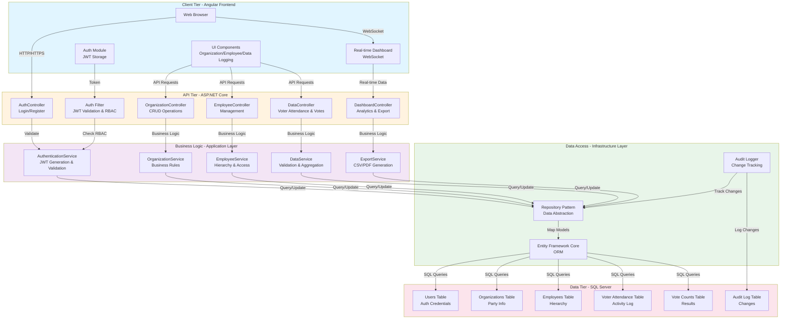
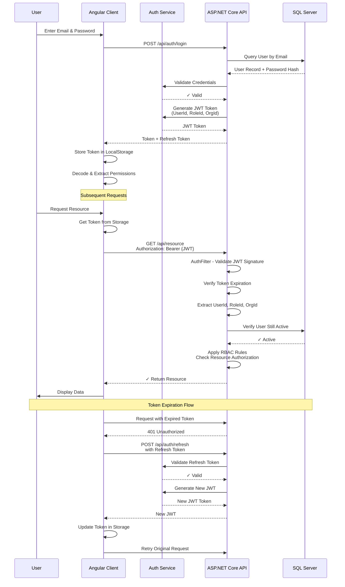
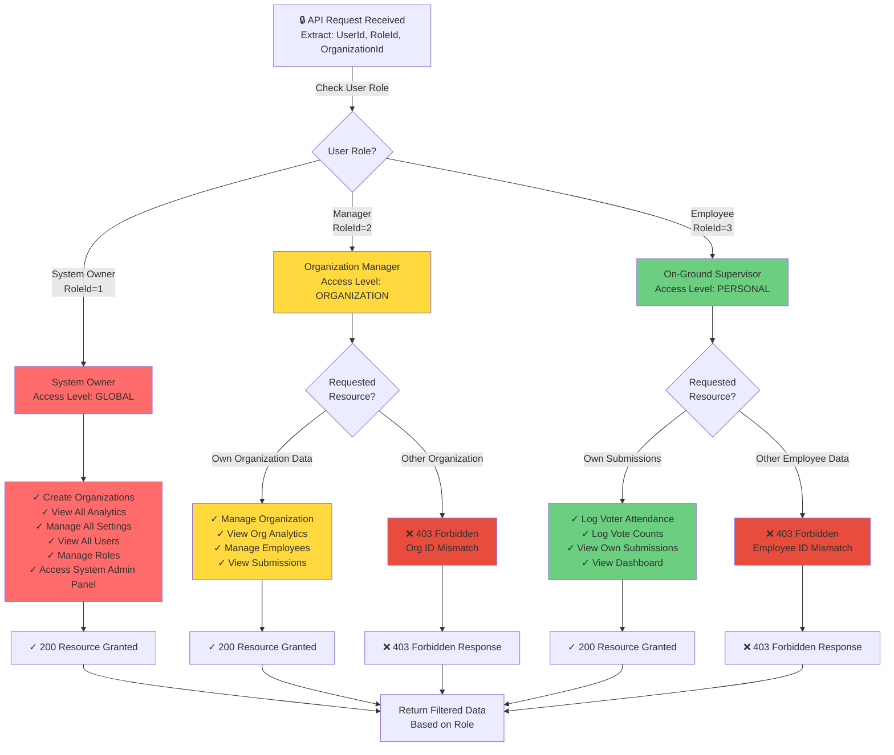
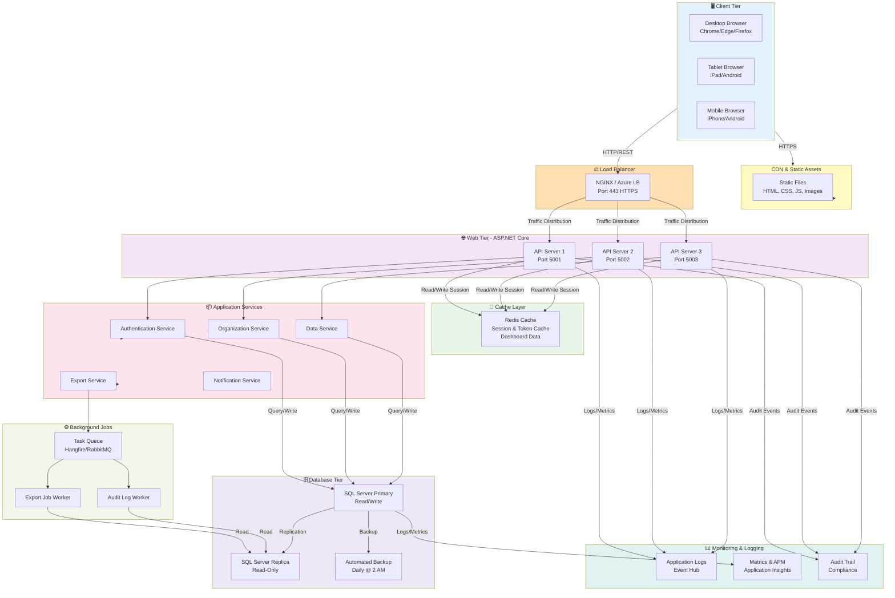

# Technical Design & Architecture Document

## Election-Voting Supervision System

**Phase 2 Deliverable: Architecture & Design Specifications**

---

## 📋 Table of Contents

1. [System Architecture Overview](#system-architecture-overview)
2. [Database Design (ERD)](#database-design-erd)
3. [Authentication & Authorization](#authentication--authorization)
4. [Role-Based Access Control (RBAC)](#role-based-access-control-rbac)
5. [Deployment Architecture](#deployment-architecture)
6. [Frontend Architecture](#frontend-architecture)
7. [API Specifications](#api-specifications)
8. [Data Flow & Interactions](#data-flow--interactions)
9. [Security Architecture](#security-architecture)
10. [Performance Considerations](#performance-considerations)

---

## System Architecture Overview

### High-Level Architecture

The system follows a **4-Tier Architecture Pattern**:

**📊 Source Diagram**: [diagrams/01-system-architecture.mmd](diagrams/01-system-architecture.mmd)  
**🖼️ PNG Snapshot**: [diagrams/01-system-architecture.png](diagrams/01-system-architecture.png)



### Key Design Principles

- **Separation of Concerns**: Each tier has distinct responsibilities
- **Repository Pattern**: Data access abstraction layer
- **Service-Oriented**: Business logic encapsulation
- **SOLID Principles**: Single Responsibility, Open/Closed, LSP, ISP, DIP
- **Dependency Injection**: Loose coupling between components
- **RESTful API**: Standard HTTP methods for resource operations

---

## Database Design (ERD)

### Database Entities & Relationships

The system uses **8 core entities** with well-defined relationships:

#### **Entity Overview**

| Entity               | Purpose                                     | Key Relationships                               |
| -------------------- | ------------------------------------------- | ----------------------------------------------- |
| **USERS**            | Authentication & User Management            | Owns ORGANIZATIONS, Creates AUDIT_LOG           |
| **ROLES**            | Role Definitions (Owner, Manager, Employee) | Referenced by USERS                             |
| **ORGANIZATIONS**    | Political Parties/Organizations             | Contains EMPLOYEES, References POLLING_STATIONS |
| **EMPLOYEES**        | On-ground Supervisors                       | Logs VOTER_ATTENDANCE, Records VOTE_COUNTS      |
| **POLLING_STATIONS** | Voting Locations                            | Associated with ORGANIZATIONS                   |
| **VOTER_ATTENDANCE** | Voter Count Logs                            | Tracked by EMPLOYEES at POLLING_STATIONS        |
| **VOTE_COUNTS**      | Vote Results per Candidate                  | Recorded by EMPLOYEES at POLLING_STATIONS       |
| **AUDIT_LOG**        | Change Tracking & Compliance                | Records all data modifications                  |

### Database Schema Details

#### **USERS Table**

```sql
-- Core user authentication and profile information
UserId (PK)                    -- Unique identifier
Email (UK)                     -- Unique, used for login
PasswordHash                   -- BCrypt/SHA256 hashed
FirstName, LastName            -- User profile
RoleId (FK → ROLES)           -- Links to role
CreatedAt, LastLoginAt        -- Timestamps
IsActive                       -- Soft delete flag
```

#### **ORGANIZATIONS Table**

```sql
-- Political party or organization entity
OrganizationId (PK)           -- Unique identifier
OrganizationName (UK)         -- Unique organization name
PartyName                     -- Full party name (e.g., "Al Kataeb")
CreatedByUserId (FK → USERS)  -- System owner who created it
ContactEmail, Address         -- Organization contact info
IsActive                      -- Active status
TotalEmployees                -- Denormalized count for dashboards
CreatedAt                     -- Timestamp
```

#### **EMPLOYEES Table**

```sql
-- On-ground supervisors/employees
EmployeeId (PK)               -- Unique identifier
OrganizationId (FK)           -- Which organization
SupervisedByUserId (FK)       -- Reporting manager
FirstName, LastName, Email    -- Employee details
PhoneNumber, DateOfBirth      -- Contact info
IsActive                      -- Employment status
CreatedAt, LastActivityAt     -- Timestamps
```

#### **VOTER_ATTENDANCE Table**

```sql
-- Voter attendance logs per polling station
AttendanceId (PK)             -- Unique identifier
EmployeeId (FK)               -- Who logged it
PollingStationId (FK)         -- Where
VoterCount                    -- Number of voters
RecordedAt                    -- When submitted
Notes                         -- Additional information
IsVerified                    -- Manager verification flag
CreatedAt                     -- Timestamp
```

#### **VOTE_COUNTS Table**

```sql
-- Vote counts by candidate per polling station
VoteCountId (PK)              -- Unique identifier
EmployeeId (FK)               -- Who recorded it
PollingStationId (FK)         -- Where
CandidateName                 -- Candidate name
VoteCount                     -- Number of votes
RecordedAt                    -- When submitted
IsVerified                    -- Manager verification flag
CreatedAt                     -- Timestamp
```

#### **AUDIT_LOG Table**

```sql
-- Complete audit trail for compliance
AuditId (PK)                  -- Unique identifier
UserId (FK)                   -- Who made change
OrganizationId (FK)           -- Optional org context
EntityType                    -- Table name (e.g., "User", "Org")
EntityId                      -- Record ID that changed
Action                        -- INSERT, UPDATE, DELETE
OldValues                     -- Previous JSON data
NewValues                     -- New JSON data
Timestamp                     -- When change occurred
```

### Database Relationships

```
USERS (1) ──manages──→ (M) ORGANIZATIONS
USERS (1) ──creates──→ (M) AUDIT_LOG
ORGANIZATIONS (1) ──contains──→ (M) EMPLOYEES
EMPLOYEES (1) ──logs──→ (M) VOTER_ATTENDANCE
EMPLOYEES (1) ──records──→ (M) VOTE_COUNTS
POLLING_STATIONS (1) ──has──→ (M) VOTER_ATTENDANCE
POLLING_STATIONS (1) ──has──→ (M) VOTE_COUNTS
```

### Entity-Relationship Diagram (ERD)

**📊 Source Diagram**: [diagrams/02-database-erd.mmd](diagrams/02-database-erd.mmd)  
**🖼️ PNG Snapshot**: [diagrams/02-database-erd.png](diagrams/02-database-erd.png)

```mermaid
erDiagram
    USERS ||--o{ ORGANIZATIONS : manages
    ORGANIZATIONS ||--o{ EMPLOYEES : contains
    EMPLOYEES ||--o{ VOTER_ATTENDANCE : logs
    EMPLOYEES ||--o{ VOTE_COUNTS : records
    USERS ||--o{ AUDIT_LOG : creates
    ORGANIZATIONS ||--o{ AUDIT_LOG : affects

    USERS {
        int UserId PK
        string Email UK
        string PasswordHash
        string FirstName
        string LastName
        int RoleId FK
        datetime CreatedAt
        datetime LastLoginAt
        bool IsActive
    }

    ROLES {
        int RoleId PK
        string RoleName UK
        string Description
    }

    ORGANIZATIONS {
        int OrganizationId PK
        string OrganizationName UK
        string PartyName
        int CreatedByUserId FK
        datetime CreatedAt
        string ContactEmail
        string Address
        bool IsActive
        int TotalEmployees
    }

    EMPLOYEES {
        int EmployeeId PK
        int OrganizationId FK
        int SupervisedByUserId FK
        string FirstName
        string LastName
        string Email UK
        string PhoneNumber
        datetime DateOfBirth
        datetime CreatedAt
        bool IsActive
        datetime LastActivityAt
    }

    VOTER_ATTENDANCE {
        int AttendanceId PK
        int EmployeeId FK
        int PollingStationId FK
        int VoterCount
        datetime RecordedAt
        string Notes
        bool IsVerified
        datetime CreatedAt
    }

    VOTE_COUNTS {
        int VoteCountId PK
        int EmployeeId FK
        int PollingStationId FK
        string CandidateName
        int VoteCount
        datetime RecordedAt
        bool IsVerified
        datetime CreatedAt
    }

    POLLING_STATIONS {
        int PollingStationId PK
        int OrganizationId FK
        string StationName
        string Location
        string Address
        int Capacity
        datetime CreatedAt
    }

    AUDIT_LOG {
        int AuditId PK
        int UserId FK
        int? OrganizationId FK
        string EntityType
        int EntityId
        string Action
        string OldValues
        string NewValues
        datetime Timestamp
    }
```

### Indexing Strategy

```sql
-- Indexes for query performance (<500ms dashboard target)
CREATE UNIQUE INDEX IX_Users_Email ON USERS(Email);
CREATE UNIQUE INDEX IX_Orgs_Name ON ORGANIZATIONS(OrganizationName);
CREATE UNIQUE INDEX IX_Employees_Email ON EMPLOYEES(Email);
CREATE INDEX IX_VoterAttendance_Employee_Station
    ON VOTER_ATTENDANCE(EmployeeId, PollingStationId, RecordedAt);
CREATE INDEX IX_VoteCounts_Employee_Station
    ON VOTE_COUNTS(EmployeeId, PollingStationId, RecordedAt);
CREATE INDEX IX_AuditLog_Entity
    ON AUDIT_LOG(EntityType, EntityId, Timestamp);
```

---

## Authentication & Authorization

### JWT Token Structure

The system uses **JWT (JSON Web Tokens)** for stateless authentication:

```json
{
  "header": {
    "alg": "HS256",
    "typ": "JWT"
  },
  "payload": {
    "sub": "UserId:12345",
    "nameid": "12345",
    "email": "manager@party.com",
    "role": "Manager",
    "organizationId": "67890",
    "iat": 1704067200,
    "exp": 1704153600,
    "iss": "voting-election-api",
    "aud": "voting-election-client"
  },
  "signature": "HMACSHA256(base64(header).base64(payload), secret)"
}
```

### Token Lifecycle

1. **Token Generation (Login)**
   - User provides credentials (Email + Password)
   - Backend validates against database
   - Generates JWT with 1-hour expiration
   - Returns Access Token + Refresh Token (7-day expiration)
   - Client stores tokens in browser LocalStorage

2. **Token Usage (Subsequent Requests)**
   - Client attaches JWT in Authorization header: `Authorization: Bearer {token}`
   - Backend validates token signature
   - Validates token expiration
   - Extracts UserId, RoleId, OrganizationId
   - Verifies user still active in database
   - Proceeds with request

3. **Token Refresh**
   - When access token expires → 401 Unauthorized
   - Client sends refresh token to `/api/auth/refresh`
   - Backend validates refresh token
   - Issues new access token
   - Client retries original request

4. **Token Revocation**
   - On logout: Remove tokens from browser
   - On password change: Blacklist old tokens
   - On deactivation: Mark user inactive

### Authentication & Authorization Sequence Diagram

**📊 Source Diagram**: [diagrams/03-auth-flow.mmd](diagrams/03-auth-flow.mmd)  
**🖼️ PNG Snapshot**: [diagrams/03-auth-flow.png](diagrams/03-auth-flow.png)



### Security Features

- **HTTPS Only**: All communication encrypted (TLS 1.3+)
- **HttpOnly Cookies (Optional)**: Alternative to localStorage
- **CORS Protection**: Whitelist allowed origins
- **Rate Limiting**: Prevent brute force attacks
- **Password Requirements**:
  - Minimum 12 characters
  - Uppercase, lowercase, numbers, special characters
  - BCrypt hashing with salt
- **Session Timeout**: Automatic logout after 30 minutes of inactivity

---

## Role-Based Access Control (RBAC)

### Role Hierarchy (3-Tier System)

```
                    SYSTEM OWNER (RoleId: 1)
                    ├─ Global Access
                    ├─ All Organizations
                    └─ System Admin Functions
                            ↓
                    ORGANIZATION MANAGER (RoleId: 2)
                    ├─ Organization-Level Access
                    ├─ Own Organization Only
                    └─ Employee Management
                            ↓
                    ON-GROUND EMPLOYEE (RoleId: 3)
                    ├─ Personal Access
                    ├─ Own Submissions
                    └─ Limited Dashboard View
```

### Permission Matrix

| Feature/Resource     | System Owner | Manager    | Employee |
| -------------------- | ------------ | ---------- | -------- |
| Create Organization  | ✅           | ❌         | ❌       |
| Manage Organization  | ✅ All       | ✅ Own     | ❌       |
| View All Analytics   | ✅           | ❌         | ❌       |
| View Org Analytics   | ✅           | ✅ Own     | ❌       |
| Create Employee      | ✅ All       | ✅ Own Org | ❌       |
| Manage Employee      | ✅ All       | ✅ Own Org | ❌       |
| Log Attendance       | ✅           | ✅         | ✅ Own   |
| Log Vote Counts      | ✅           | ✅         | ✅ Own   |
| View All Submissions | ✅           | ✅ Own Org | ✅ Own   |
| Export Data          | ✅           | ✅ Own Org | ❌       |
| System Admin Panel   | ✅           | ❌         | ❌       |

### RBAC Authorization Flow

**📊 Source Diagram**: [diagrams/04-rbac-flow.mmd](diagrams/04-rbac-flow.mmd)  
**🖼️ PNG Snapshot**: [diagrams/04-rbac-flow.png](diagrams/04-rbac-flow.png)



### Access Control Implementation

#### Backend Validation

```csharp
// Authorize attribute with roles
[Authorize(Roles = "SystemOwner")]
public IActionResult ManageAllOrganizations() { ... }

[Authorize(Roles = "SystemOwner,Manager")]
public IActionResult ViewOrganizationData(int orgId)
{
    // Additional check: Ensure Manager only sees their own org
    if (User.IsInRole("Manager") && !IsUserInOrganization(orgId))
        return Forbid();
    ...
}

[Authorize(Roles = "Employee")]
public IActionResult LogVoterAttendance(int employeeId)
{
    // Verify employee can only log for themselves
    if (GetUserId() != employeeId)
        return Forbid();
    ...
}
```

#### Frontend Route Guards

```typescript
// Angular Route Guard
@Injectable()
export class RoleGuard implements CanActivate {
  canActivate(route: ActivatedRouteSnapshot): boolean {
    const requiredRoles = route.data["roles"];
    const userRole = this.authService.getUserRole();
    return requiredRoles.includes(userRole);
  }
}

// Usage in routing
const routes: Routes = [
  {
    path: "admin",
    component: AdminComponent,
    canActivate: [RoleGuard],
    data: { roles: ["SystemOwner"] },
  },
  {
    path: "dashboard",
    component: DashboardComponent,
    canActivate: [RoleGuard],
    data: { roles: ["SystemOwner", "Manager", "Employee"] },
  },
];
```

---

## Deployment Architecture

### Production Environment Setup - Deployment Diagram

**📊 Source Diagram**: [diagrams/05-deployment-architecture.mmd](diagrams/05-deployment-architecture.mmd)  
**🖼️ PNG Snapshot**: [diagrams/05-deployment-architecture.png](diagrams/05-deployment-architecture.png)



The system is designed for **scalability and high availability**:

#### Load Balancing

- **NGINX / Azure Load Balancer** distributes traffic
- **3+ API server instances** for redundancy
- **Health checks** every 10 seconds
- **Sticky sessions** for user experience

#### Caching Layer

- **Redis Cache** for:
  - JWT token blacklist
  - Session data
  - Dashboard aggregations
  - Rate limiting counters
- **TTL**: 1 hour for tokens, 24 hours for dashboards

#### Database Tier

- **SQL Server Primary**: Read/Write operations
- **SQL Server Replica**: Read-only for reporting
- **Automated Backups**: Daily @ 2 AM UTC
- **Replication**: Continuous with Primary

#### Background Jobs

- **Task Queue**: Hangfire or RabbitMQ
- **Export Job Worker**: Generate CSV/PDF files asynchronously
- **Audit Log Worker**: Process audit entries
- **Cleanup Job**: Clear expired tokens daily

#### Monitoring & Logging

- **Application Insights**: Performance metrics, errors
- **Event Hub**: Centralized logging
- **Email Alerts**: Critical errors notify admin
- **Dashboard**: Real-time system health

### Infrastructure Requirements

| Component      | Specification              | Notes                         |
| -------------- | -------------------------- | ----------------------------- |
| API Servers    | 3x Azure App Service (B2+) | 2 cores, 4GB RAM each         |
| Database       | SQL Server Standard S3     | 100 DTUs, 250GB storage       |
| Cache          | Redis Premium              | 6GB, High Availability        |
| CDN            | Azure CDN                  | For static assets             |
| Load Balancer  | Azure LB or NGINX          | Distribution across 3 servers |
| Backup Storage | Azure Blob Storage         | Geo-redundant                 |

---

## Frontend Architecture

### Angular Module Structure - Frontend Architecture Diagram

**📊 Source Diagram**: [diagrams/06-frontend-architecture.mmd](diagrams/06-frontend-architecture.mmd)  
**🖼️ PNG Snapshot**: [diagrams/06-frontend-architecture.png](diagrams/06-frontend-architecture.png)

```mermaid
graph TB
    subgraph Root["🅰️ Angular App Module"]
        AppRoot["AppComponent<br/>Root Container"]
    end

    subgraph Core["Core Module<br/>Singleton Services"]
        AuthService["AuthService<br/>JWT & User Management"]
        HTTPInterceptor["HTTP Interceptor<br/>Auto Token Injection"]
        Logger["Logger Service"]
        ErrorHandler["Error Handler"]
    end

    subgraph Shared["Shared Module<br/>Reusable Components"]
        Header["Header Component"]
        Navigation["Navigation Component"]
        Modal["Modal Dialog"]
        DataTable["Data Table"]
        Form["Reactive Form Controls"]
        Pipes["Custom Pipes<br/>DateFormat, Currency"]
        Directives["Custom Directives<br/>HighlightError, Loading"]
    end

    subgraph Auth["Auth Module<br/>Authentication"]
        LoginComp["LoginComponent"]
        RegisterComp["RegisterComponent"]
        AuthService2["AuthService"]
        Guards["Route Guards<br/>AuthGuard, RoleGuard"]
    end

    subgraph OrgModule["Organization Module"]
        OrgList["OrganizationListComponent"]
        OrgDetail["OrganizationDetailComponent"]
        OrgForm["OrganizationFormComponent"]
        OrgService["OrganizationService"]
        OrgStateFac["Org State Facade"]
    end

    subgraph EmpModule["Employee Module"]
        EmpList["EmployeeListComponent"]
        EmpDetail["EmployeeDetailComponent"]
        EmpForm["EmployeeFormComponent"]
        EmpService["EmployeeService"]
        EmpStateFac["Emp State Facade"]
    end

    subgraph DataModule["Data Logging Module"]
        AttendanceComp["Voter AttendanceComponent"]
        VoteCountComp["Vote CountComponent"]
        DataService["DataService"]
        FormValidator["Custom Validators"]
        DataStateFac["Data State Facade"]
    end

    subgraph Dashboard["Dashboard Module"]
        DashMain["DashboardComponent"]
        Charts["Chart Components<br/>Line, Bar, Pie"]
        Stats["Statistics Widget"]
        DashService["DashboardService"]
    end

    subgraph Admin["Admin Module<br/>System Owner Only"]
        SystemConfig["System ConfigComponent"]
        UserMgmt["User ManagementComponent"]
        Reports["Reports GeneratorComponent"]
        AdminService["AdminService"]
    end

    subgraph HttpLayer["HTTP Communication Layer"]
        HttpClient["Interceptor + HttpClient"]
        ApiUrls["API Constants<br/>Endpoint URLs"]
    end

    Root --> Core
    Root --> Shared
    Root --> Auth
    AppRoot -->|Routes| OrgModule
    AppRoot -->|Routes| EmpModule
    AppRoot -->|Routes| DataModule
    AppRoot -->|Routes| Dashboard
    AppRoot -->|Routes| Admin

    Auth -->|Uses| Core
    Auth -->|Uses| Shared

    OrgModule -->|Uses| Shared
    OrgModule -->|Uses| Core
    OrgService -->|HTTP| HttpLayer
    OrgForm -->|Uses| FormValidator

    EmpModule -->|Uses| Shared
    EmpModule -->|Uses| Core
    EmpService -->|HTTP| HttpLayer
    EmpForm -->|Uses| FormValidator

    DataModule -->|Uses| Shared
    DataModule -->|Uses| Core
    DataService -->|HTTP| HttpLayer
    AttendanceComp -->|Uses| FormValidator
    VoteCountComp -->|Uses| FormValidator

    Dashboard -->|Uses| Shared
    Dashboard -->|Uses| Core
    DashService -->|HTTP| HttpLayer

    Admin -->|Uses| Shared
    Admin -->|Uses| Core
    AdminService -->|HTTP| HttpLayer

    HTTPInterceptor -->|Injects Token| HttpLayer
    AuthService -->|Validates| Guards
    Guards -->|Protects Routes| Root

    HttpLayer -->|API Calls| ASPNetCore["ASP.NET Core Backend<br/>REST API"]

    style Root fill:#1976d2
    style Core fill:#d32f2f
    style Shared fill:#f57c00
    style Auth fill:#7b1fa2
    style OrgModule fill:#0097a7
    style EmpModule fill:#00796b
    style DataModule fill:#5e35b1
    style Dashboard fill:#c2185b
    style Admin fill:#e64a19
    style HttpLayer fill:#ffb300
```



The frontend follows **Angular modular architecture** with 6 feature modules:

#### **Core Module** (Singleton Services)

- Authentication Service
- HTTP Interceptor
- Logger Service
- Error Handler

#### **Shared Module** (Reusable Components)

- Header Component
- Navigation Component
- Data Table
- Modal Dialog
- Custom Pipes & Directives

#### **Auth Module**

- Login Component
- Register Component
- Route Guards (AuthGuard, RoleGuard)

#### **Organization Module**

- List Organizations
- Organization Details
- Create/Edit Organization
- Organization Service

#### **Employee Module**

- List Employees
- Employee Details
- Create/Edit Employee
- Employee Service

#### **Data Logging Module**

- Log Voter Attendance
- Log Vote Counts
- Form Validation
- Data Service

#### **Dashboard Module**

- Organization Dashboard
- Analytics Dashboard
- Chart Components (Line, Bar, Pie)
- Statistics Widgets

#### **Admin Module** (System Owner Only)

- System Configuration
- User Management
- Reports Generator

### Component Communication

- **Parent → Child**: `@Input` properties
- **Child → Parent**: `@Output` events
- **Service Communication**: Shared services with RxJS Observables
- **State Management**: Facade pattern for complex state

---

## API Specifications

### Base URL

```
Production: https://api.voting-election.com/api
Development: http://localhost:5001/api
```

### Authentication Endpoints

#### **POST /auth/login**

```json
Request: {
  "email": "owner@system.com",
  "password": "SecurePassword123!"
}

Response: {
  "accessToken": "eyJhbGciOiJIUzI1NiIs...",
  "refreshToken": "eyJhbGciOiJIUzI1NiIs...",
  "expiresIn": 3600,
  "user": {
    "userId": 1,
    "email": "owner@system.com",
    "firstName": "System",
    "lastName": "Owner",
    "role": "SystemOwner",
    "organizationId": null
  }
}
```

#### **POST /auth/register**

```json
Request: {
  "email": "newuser@example.com",
  "password": "SecurePassword123!",
  "firstName": "John",
  "lastName": "Doe",
  "roleId": 2
}

Response: {
  "userId": 5,
  "email": "newuser@example.com",
  "message": "User registered successfully"
}
```

#### **POST /auth/refresh**

```json
Request: {
  "refreshToken": "eyJhbGciOiJIUzI1NiIs..."
}

Response: {
  "accessToken": "eyJhbGciOiJIUzI1NiIs..."
}
```

### Organization Endpoints

#### **GET /organizations**

- **Auth**: Requires SystemOwner or Manager role
- **Response**: List of accessible organizations
- **Query Params**: `?page=1&pageSize=10&search=party`

#### **POST /organizations**

- **Auth**: Requires SystemOwner role
- **Request**: Organization details
- **Response**: Created organization with ID

#### **GET /organizations/{id}**

- **Auth**: Requires access to organization
- **Response**: Organization details with employee count

#### **PUT /organizations/{id}**

- **Auth**: Requires SystemOwner or own Manager
- **Request**: Updated organization data
- **Response**: Updated organization

#### **DELETE /organizations/{id}**

- **Auth**: Requires SystemOwner
- **Response**: Success/Error message

### Employee Endpoints

#### **GET /organizations/{orgId}/employees**

- **Auth**: Manager of organization or SystemOwner
- **Response**: List of employees in organization

#### **POST /organizations/{orgId}/employees**

- **Auth**: Manager of organization or SystemOwner
- **Request**: Employee details
- **Response**: Created employee with ID

### Data Logging Endpoints

#### **POST /data/voter-attendance**

```json
Request: {
  "pollingStationId": 1,
  "voterCount": 250,
  "notes": "High turnout observed"
}

Response: {
  "attendanceId": 100,
  "recordedAt": "2025-03-15T14:30:00Z",
  "isVerified": false
}
```

#### **POST /data/vote-counts**

```json
Request: {
  "pollingStationId": 1,
  "candidateName": "Candidate A",
  "voteCount": 150
}

Response: {
  "voteCountId": 50,
  "recordedAt": "2025-03-15T14:31:00Z",
  "isVerified": false
}
```

### Dashboard Endpoints

#### **GET /dashboard/analytics**

- **Auth**: SystemOwner role
- **Response**: System-wide analytics (cached)

#### **GET /organizations/{orgId}/dashboard**

- **Auth**: Manager or SystemOwner
- **Response**: Organization analytics

#### **GET /dashboard/export?format=csv|pdf&dateRange=today|week|month**

- **Auth**: Manager or SystemOwner
- **Response**: File download or async job ID

---

## Data Flow & Interactions

### User Registration Flow

```
1. New System Owner requests account
2. Admin manually creates user in database (initial seed)
3. User receives credentials
4. User logs in via login page
5. Backend validates credentials
6. JWT token generated and returned
7. Token stored in browser localStorage
8. Angular app routing updates
```

### Organization Creation Flow

```
System Owner
    ↓
Click "Create Organization"
    ↓
Angular Form Component (validation)
    ↓
HTTP POST /api/organizations
    ↓
JWT Token in Authorization header
    ↓
ASP.NET Core OrganizationController
    ↓
Authorize(SystemOwner) filter ✓
    ↓
OrganizationService (business logic)
    ↓
Entity Framework → INSERT Organization
    ↓
SQL Server Database
    ↓
AuditLog created (INSERT record)
    ↓
Response back to Angular
    ↓
UI updated with new organization
```

### Voter Attendance Logging Flow

```
On-Ground Employee
    ↓
Mobile/Tablet Browser → Attendance Form
    ↓
Fill: Voter Count, Notes
    ↓
Custom Validators (client-side)
    ↓
HTTP POST /api/data/voter-attendance
    ↓
Server receives request
    ↓
AuthFilter validates JWT
    ↓
Extract EmployeeId from token
    ↓
DataController.LogAttendance()
    ↓
DataService (business rules)
    ↓
Verify employee can log for this station
    ↓
Create VOTER_ATTENDANCE record
    ↓
Create AUDIT_LOG entry
    ↓
Save to database
    ↓
Response: Success + AttendanceId
    ↓
Angular updates local state
    ↓
UI confirmation message
```

### Dashboard Data Aggregation

```
Manager views organization dashboard
    ↓
HTTP GET /api/organizations/{id}/dashboard
    ↓
Check Redis cache
    ↓
NOT cached → Query database
    ↓
Aggregate VOTER_ATTENDANCE (sum, avg)
    ↓
Aggregate VOTE_COUNTS (sum by candidate)
    ↓
Calculate percentages & trends
    ↓
Store in Redis (TTL: 24 hours)
    ↓
Return JSON to client
    ↓
Angular displays charts & statistics
```

---

## Security Architecture

### Threat Model & Mitigation

| Threat                  | Mitigation Strategy                                      |
| ----------------------- | -------------------------------------------------------- |
| **Password Breach**     | BCrypt hashing, 12+ char requirement, special characters |
| **Token Theft**         | HTTPS only, JWT signature validation, short expiration   |
| **Unauthorized Access** | RBAC, organizational isolation, audit logging            |
| **SQL Injection**       | Entity Framework ORM, parameterized queries              |
| **CSRF Attacks**        | CORS configuration, SameSite cookie flag                 |
| **DDoS**                | Rate limiting, CDN protection, load balancing            |
| **Data Tampering**      | Digital signatures, audit trail, checksums               |
| **Session Hijacking**   | HTTPS, secure token storage, device tracking             |

### Data Isolation & Privacy

#### Organizational Isolation (Multi-Tenancy)

```sql
-- Managers can only see their organizations
SELECT * FROM ORGANIZATIONS
WHERE CreatedByUserId = @UserId
   OR OrganizationId IN (
     SELECT OrganizationId FROM EMPLOYEES
     WHERE SupervisedByUserId = @UserId
   )
```

#### Employee-Level Isolation

```sql
-- Employees only see their own submissions
SELECT * FROM VOTER_ATTENDANCE
WHERE EmployeeId = @EmployeeId
```

### Compliance & Audit

- **Audit Logging**: Every INSERT, UPDATE, DELETE tracked
- **WCAG 2.1 AA**: Accessibility compliance
- **GDPR Ready**: Data export, deletion capabilities
- **SOC 2**: Security controls documented

---

## Performance Considerations

### Performance Targets

- **Page Load**: < 2 seconds
- **Dashboard Refresh**: < 500ms
- **API Response**: < 200ms (avg)
- **Concurrent Users**: 100+

### Optimization Strategies

#### Database Optimization

```sql
-- Partitioning large tables by date
CREATE PARTITION FUNCTION DatePartition (datetime)
AS RANGE LEFT FOR VALUES (...);

-- Indexed views for common aggregations
CREATE INDEXED VIEW VoterAttendanceSummary AS
SELECT PollingStationId, SUM(VoterCount) as Total
FROM VOTER_ATTENDANCE
GROUP BY PollingStationId;
```

#### API Optimization

- **Caching**: Redis for dashboard data (24h TTL)
- **Compression**: Gzip response compression
- **Pagination**: Default 20 items per page
- **Async Operations**: Background jobs for exports
- **Query Optimization**: Entity Framework Include() for lazy loading

#### Frontend Optimization

- **Code Splitting**: Lazy-loaded modules
- **Tree Shaking**: Remove unused code
- **Minification**: Production build optimization
- **Image Optimization**: WebP format, lazy loading
- **CDN**: Static assets cached globally

### Monitoring & SLAs

| Metric         | Target  | Consequence                 |
| -------------- | ------- | --------------------------- |
| Uptime         | 99.9%   | < 43 minutes downtime/month |
| API Response   | < 200ms | 95th percentile             |
| Dashboard Load | < 500ms | 90th percentile             |
| Error Rate     | < 0.1%  | Auto-alert if exceeded      |

---

## Integration Points

### Third-Party Services (Optional)

1. **Email Service** (SendGrid/Azure Mail)
   - User registration confirmation
   - Password reset
   - Organization invitations

2. **SMS Service** (Twilio)
   - Two-factor authentication
   - Critical alerts

3. **Storage Service** (Azure Blob)
   - Archived exports
   - Backup storage

4. **Analytics** (Application Insights)
   - Performance monitoring
   - Error tracking

---

## Deployment Checklist

- [ ] Database created and seeded
- [ ] Entity Framework migrations applied
- [ ] JWT secret configured
- [ ] CORS origins whitelisted
- [ ] SSL certificate installed
- [ ] Redis configured
- [ ] Load balancer configured
- [ ] Monitoring alerts set up
- [ ] Backup jobs scheduled
- [ ] Admin user account created
- [ ] API documentation published
- [ ] Log aggregation enabled

---

## Next Steps (Phase 3)

1. **API Endpoint Implementation** - Implement all endpoints listed above
2. **Database Migrations** - Create Entity Framework Code-First models
3. **Authorization Middleware** - Implement custom RBAC logic
4. **Frontend Components** - Build Angular components for each module
5. **Testing** - Unit tests, integration tests, E2E tests
6. **Documentation** - Swagger/OpenAPI documentation

---

**Document Status**: ✅ Complete  
**Last Updated**: April 2, 2026  
**Version**: 1.0
